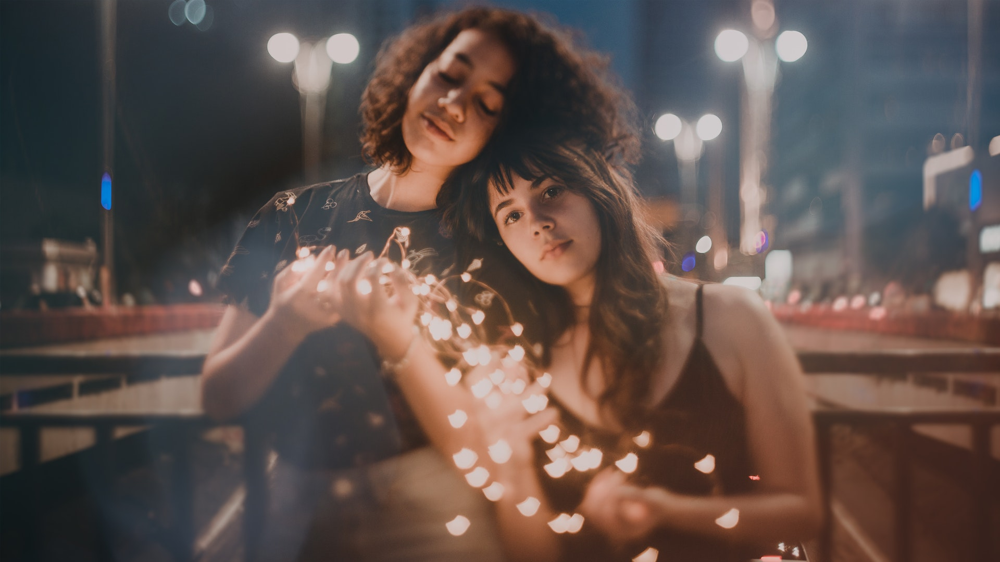

Blur the image. The value goes from `0.3` and `1000`

## Example

<pre><code class="hljs css html" data-preview>https://caravaggio.host/<strong>blur_10</strong>/https://goo.gl/EXv4MP</code></pre>

**Original**     

**Result**     

