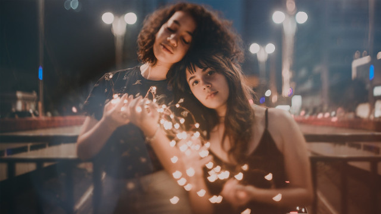

This paramter let you rotate the image.    
Any angle multiple of `90°` is accepted.

<pre><code class="hljs css html" data-preview>https://caravaggio.host/<strong>rotate_270</strong>/https://goo.gl/EXv4MP</code></pre>

**Original**     

**Result**     

